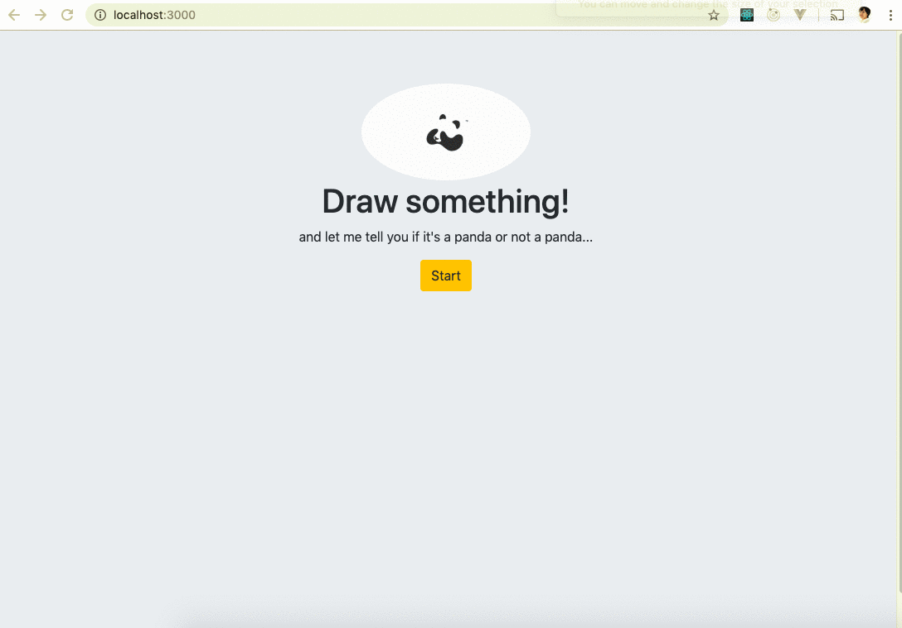

# Not Panda #

### An app that tells if you just doodled a panda or not a panda ###
  > You have 20 seconds to draw it!
  
## Demo ##
 > More demo available in [demo](demo) folder
 
 
 

## Problem ##
  > What makes a panda panda? I wish there's an app on the market that helps me with that!

## Solution ##
  > Build something to demystify panda

## Quote from You ##
  > "Get your doodle recognized in a whole new way"

## How to Get Started ##
### Prerequisite
- Install PostgreSQL:
https://www.postgresql.org/download/macosx/
- Start a PSQL server
```postgres -D /usr/local/var/postgres```
- In a new window, create database 'quickdraw'
```createdb quickdraw```
- Use 'quickdraw' database
```psql -s quickdraw```
- Copy code in schema.sql and paste into the database command line to create tables and schemas

### Installing
```npm install```

### Seed Data
- Download .ndjson simplified drawing files from [Google Creative Lab - Quickdraw Dataset] (https://console.cloud.google.com/storage/browser/quickdraw_dataset/full/simplified)
- Create a ndjson folder in /data, and store .ndjson files
- ```npm run seed-all```
 
 ### Build
```npm run build```

### Start Server
```npm start```

### Train Model ##
```npm run training```


## Customer Stories ##
  > "I'm really happy with Not Panda. It's reliable, easy-to-use, and is constantly improving!" - *Steve*
  
  > "I used to spend 15-20% of time pondering whether I just drew a panda or a koala. Now I know the answer within milliseconds!" - *Jessica*
  
  > "I love that I don't need to think about panda very much! Not Panda just takes care of all for me." - *Aly*
