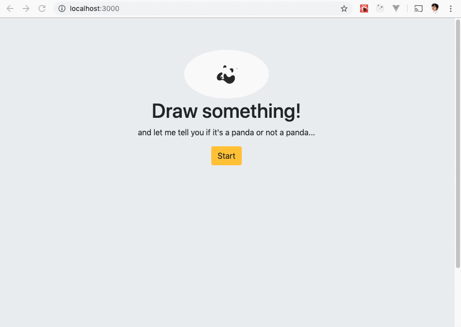

# Not Panda #

### An app that tells if you just doodled a panda or not a panda ###
  > You have 20 seconds to draw it!
  
## Demo ##
 

## Problem ##
  > What makes a panda panda? I wish there's an app on the market that helps me with that!

## Solution ##
  > Build something to demystify panda

## Quote from You ##
  > "Get your doodle recognized in a whole new way"

## How to Get Started ##
  ### Installing
```npm install```
 ### Seed Data
 - 
 
 ### Build
```npm run build```

### Start Server
```npm start```

## Customer Stories ##
  > "I'm really happy with Not Panda. It's reliable, easy-to-use, and is constantly improving!" - *Steve*
  
  > "I used to spend 15-20% of time pondering whether I just drew a panda or a koala. Now I know the answer within milliseconds!" - *Jessica*
  
  > "I love that I don't need to think about panda very much! Not Panda just takes care of all for me." - *Aly*

## Closing and Call to Action ##
  > Wrap it up and give pointers where the reader should go next.
